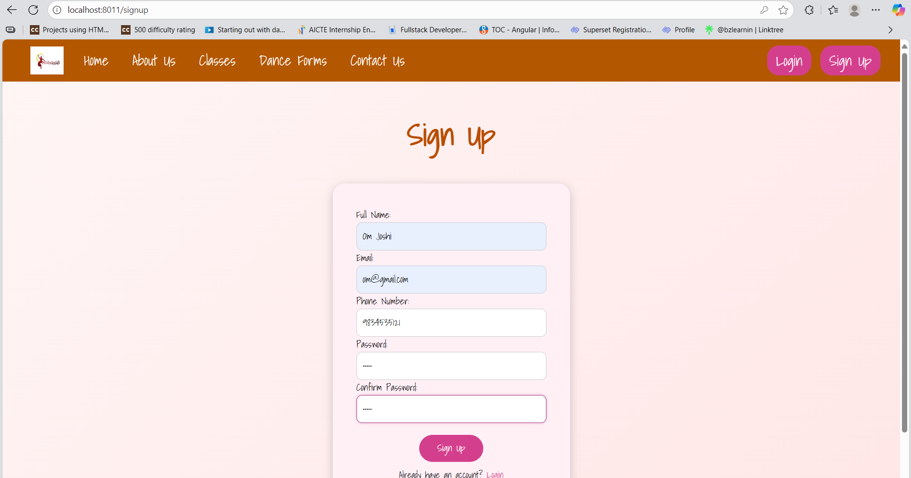
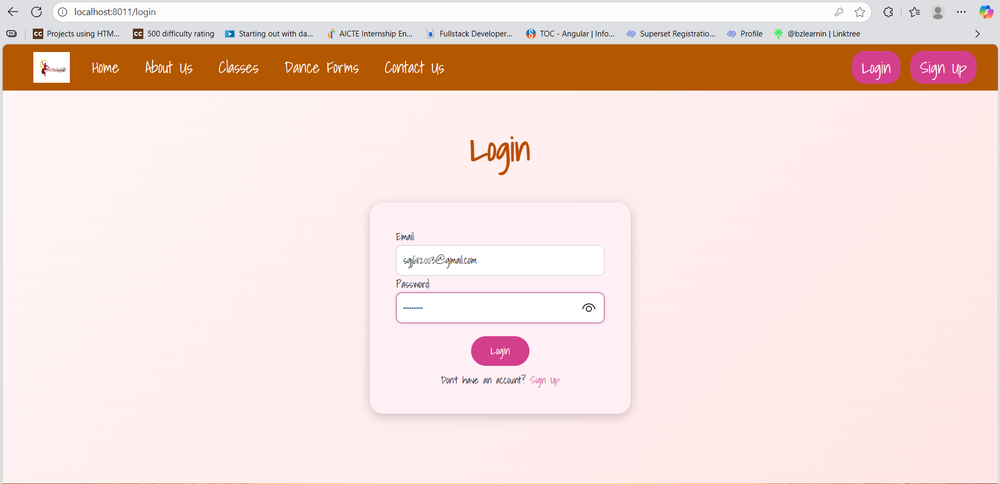
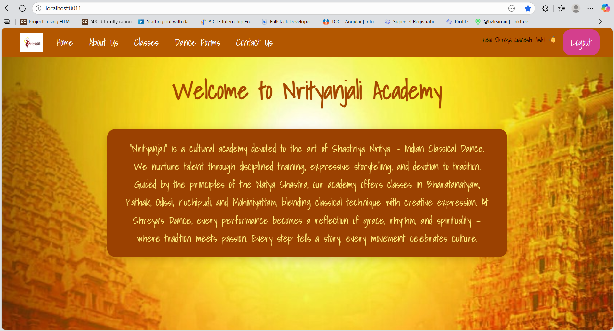
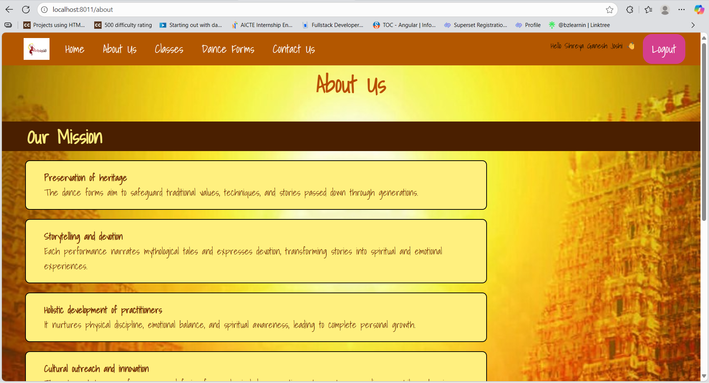
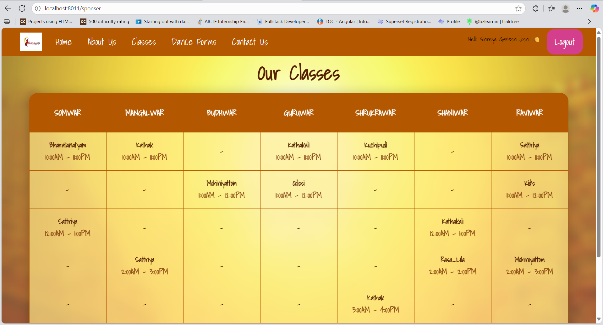
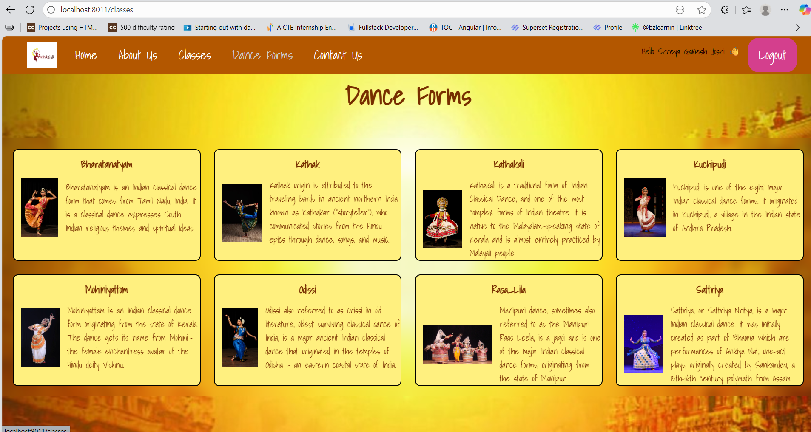
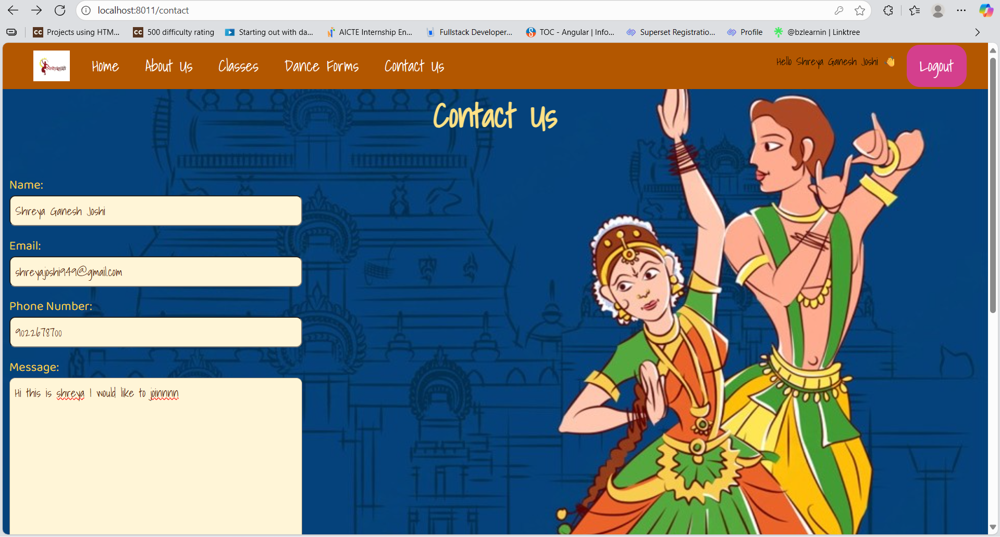

# Nrityanjali-A-dance-academy-website
A responsive and elegant dance academy website built using HTML (Pug), CSS, and JavaScript. It features pages like Home, About, Classes, Dance Forms, and Contact, designed to showcase the academy’s offerings while maintaining a smooth user experience.

### Register

### Login

### Home

### About Us 

### Classes

### Dance Forms

### Contact Us 

